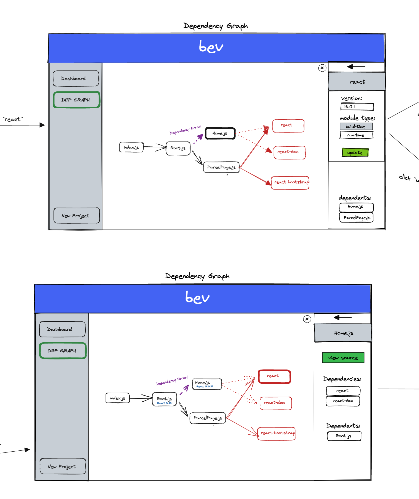

# bev Contribution Guide
Welcome to *bev*'s guide to help those interested in contributing to this excellent open source product.

For fast navigation, use the table of contents icon  on the top-left corner of this document to get to a specific section of this guide more efficiently.

## Getting Started - Familiarizing Yourself With bev's Directories
Before outlining current issues and conceptualized new features for this product, I would like to provide a brief run-down of the features contained within this application.

### app/main/
Contains a few small files which leverage electron and others to interact directly with the user's native OS.

* `io.js` contains the logic which allows a user to select or remove folders, as well as the logic to analyze the dependencies of provided folder paths.
* `notification.js` houses minor logic to natively render notifications to the user's machine.

### render/assets/
Contains all assets displayed in the application.

### render/html/
This is the folder the application is where webpack will build to.
As such, the entirety of its contents are in the gitignore.

### render/js/
Content intended to communicate with the backend (`app/main/`) and render content from it to the frontend.
Though this intent could seem in contradiction with the next section's description, bearing in mind that this is to specifically be an intermediary between front and back end features will help understand its place in this application's architecture.

### render/src/
All front end rendering via React is housed here.
Internal components rendered through `App.jsx` can be found in the components directory.

## Conceptualized New Features & Existing Bugs
### The Bounty Board (Bugs)
* Nodes reposition when selected (position should only change on drag)
* Cannot unselect a node until it has moved (selecting again, regardless of position, should unselect)
* Electron application, once built, does not run properly on MacOS (unable to properly store `results.json` due to a filepath issue)
  * The core of this issue is that the `generateBundleInfo()` function in `io.js` relies on use of the `webpack` CLI to do it's thing
    * Applications on MacOS will not have access to non-standard CLIs
    * Webpack can be imported and leveraged directly through Node.js to accomplish the same output, but more research into its configuration is required

### Features
* Improved Testing
  * CI/CD which automatically builds and deploys latest to `bev.dev` when all tests pass successfully on any merge to `main`
* Implement GitHub Releases
* Improved performance by creating a bash file which pairs down what is currently done by the webpack-cli in `io.js`
* Identify errant and unused dependencies (first & third party)
  * Some progress for this has been performed in the `modify-unused-dependencies`
* Ability to delete Nodes from the dependency graph
* Drag/Create edges in the dependency graph
  * Only for first party files (no node modules)
  * This should also programmatically update imports in the respective first party files the action is performed on
* Create a right-hand panel which displays information on the selected Node in the Dependency Chart
  * 
* If the right-hand display panel is implemented, functionality to edit first party files directly is desirable